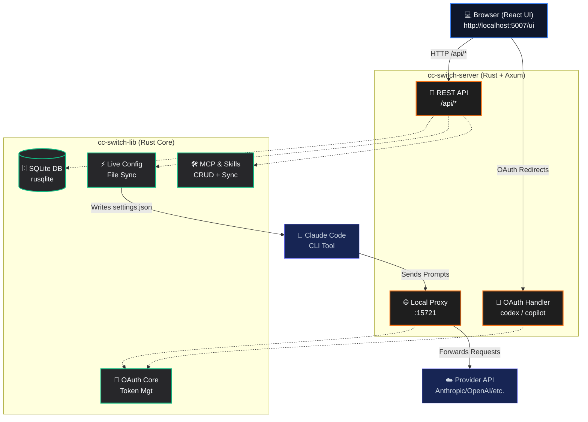

# CC Switch UI

**Managing Claude Code Provider configurations has never been easier.**

[](https://github.com/huangbogeng/cc-switch-ui)
[](https://github.com/huangbogeng/cc-switch-ui)
[](LICENSE)

[**中文文档**](README_zh.md)

---

## 🎯 What It Solves

Configuring API Providers for Claude Code traditionally requires manually editing JSON files, memorizing various API endpoints, and handling complex OAuth authorization flows. 

**CC Switch UI lets you manage all of this in a browser-first workflow:**

- **One-click Provider Switching:** Instantly switch between 50+ model providers without ever touching a config file.
- **Built-in Presets:** 50+ pre-configured providers (DeepSeek, OpenAI, Anthropic, Google, Copilot, Codex, MiniMax, etc.).
- **Dual Authentication Support:** Supports both API Key and OAuth authentication flows.
- **Direct Config + Local Route:** Manage direct provider config and local route takeover separately.
- **Real-time Live Sync:** Changes are immediately synchronized with your local Claude Code configuration and take effect instantly.

---

## 📌 Project Status (2026-06-01)

- **All core features complete**: Providers (50+ presets), local route takeover, MCP Servers, Skills, Proxy, OAuth, Usage tracking.
- Backend database module modularized into domain sub-modules (`providers`, `mcp`, `skills`, `proxy`, `usage`, `migrations`, `types`).
- Proxy streaming pipeline modularized under `cc-switch-server/src/proxy/streaming/`.
- Usage supports both proxy-mode logs and Claude local session-log sync (`~/.claude/projects/*/*.jsonl`).
- Custom providers now support endpoint detection, model list fetch, and protocol-specific routing (`anthropic`, `openai_chat`, `openai_responses`).

---

## 🚀 Supported Providers

50+ providers with presets, including:

| Provider | Type | Auth Method | Description |
|----------|------|-------------|-------------|
| **Anthropic** | Official | API Key | Claude Opus, Sonnet, Haiku models |
| **OpenAI** | Official | API Key | GPT series, o-series models |
| **DeepSeek** | Official | API Key | DeepSeek V4, R1 models |
| **Google Gemini** | Official | API Key | Gemini 2.5, 2.0 models |
| **Copilot** | GitHub | OAuth | GPT, Claude via GitHub Copilot |
| **Codex** | OpenAI | OAuth | ChatGPT Plus/Pro subscription |
| **MiniMax** | Official | API Key | M2.7 and other models |
| **SiliconFlow** | Aggregator | API Key | Various models |
| **OpenRouter** | Aggregator | API Key | 200+ Models available |

---

## 🏁 Quick Start

### Easy Installation (Linux & macOS)

The easiest way to install CC Switch UI is using our installation script:

```bash
curl -fsSL https://raw.githubusercontent.com/huangbogeng/cc-switch-ui/main/install.sh | bash
```

After installation, simply run:

```bash
cc-switch-ui
```

The installer places the application under `~/.local/share/cc-switch-ui` by default. User data stays in `~/.cc-switch`, including the SQLite database.

### CLI Commands

`cc-switch-ui start` launches the backend server and serves frontend static assets (`/ui`) in one process (production mode).

```bash
# Start with defaults: 0.0.0.0:5007, proxy 15721
cc-switch-ui start

# Custom bind/proxy ports
cc-switch-ui start --host 127.0.0.1 --port 5007 --proxy-port 15721

# Health check
cc-switch-ui status

# Show version
cc-switch-ui version

# Diagnose installation/path/permission issues
cc-switch-ui doctor
```

### Build from Source

If you prefer to build from source:

```bash
# Build frontend assets first (required for /ui in production mode)
cd cc-switch-ui && npm ci && npm run build && cd ..

# Build and run CLI entrypoint
cargo build --release
cargo run -p cc-switch-cli -- start
```

### 2. Access the Web UI

Open your browser and navigate to: **http://localhost:5007/ui**

*(Note: An admin token is required for the first login, which can be found printed in your terminal startup logs.)*

### 3. Add a Provider

1. Go to the **Providers** page in the dashboard.
2. Select a preset or configure a custom endpoint.
3. Enter your API Key if required.
4. Optionally use **Detect endpoint type** and **Fetch models** for custom endpoints.
5. Click **Save** and switch to it.

Claude Code will immediately start using the selected direct Provider.

### 4. Optional: Enable Local Route Takeover

1. Stay on the **Providers** page.
2. Pick a **Route Target** in the `Local Route` panel.
3. Start the local route.

Once started, Claude Code traffic goes to the local route first, then the route forwards requests to the selected target provider.

---

## ✨ Features

### 🔌 Provider Management
- 50+ built-in Provider presets for quick setup.
- Support for custom Provider configurations.
- One-click switching with real-time configuration sync.
- Endpoint-type detection for custom URLs.
- Model list fetch for OpenAI-compatible `/models` endpoints.
- Failover queue with circuit breaker.

### 🔑 OAuth Authentication
- **Codex**: Device code OAuth flow for ChatGPT Plus/Pro subscription.
- **GitHub Copilot**: Device code OAuth flow with multi-account and GHES support.
- Multi-account management for both Codex and Copilot.

### 🛠 MCP Servers
- Full CRUD management for MCP servers with JSON editor.
- Sync to `~/.claude.json` preserving other root fields.
- Import from existing Claude Code config.
- Enable/disable toggle per server.

### 📦 Skills
- Full CRUD management for Claude Code skills.
- Sync from SSOT (`~/.cc-switch/skills/`) to `~/.claude/skills/`.
- Import from `~/.claude/skills/` and `~/.claude/plugins/`.
- Collection grouping and enable/disable toggle.

### 🌐 Local Proxy Server
- HTTP proxy on port 15721 (configurable).
- Provider adapter chain with request/response format conversion.
- Separate route target selection and route start/stop control.
- Circuit breaker per provider, failover queue.
- Streaming response transformation (Anthropic ↔ OpenAI formats).

### ⚡ Live Config
- Automatically writes direct configurations to Claude Code when switching Providers.
- Local route takeover can replace direct config at runtime without changing the selected direct provider.
- Merge-only env updates preserve other settings in `settings.json`.
- Completely eliminates the need to manually edit config files.

### 📊 Usage Monitoring (Current Behavior)
- Request logs and trend charts are sourced from `proxy_request_logs`.
- Session usage sync is available via `POST /api/usage/sync-session` and can import Claude local JSONL sessions.
- Data source breakdown is available via `GET /api/usage/sources` (`proxy` / `session_log`).
- Model pricing is used for session-synced records; proxy-ingested records currently keep `total_cost_usd` empty/zero unless cost is filled later in the pipeline.

---

## 🏗 Architecture

CC Switch UI is a browser-first Web architecture with a Rust workspace backend:



---

## ⚙️ Configuration

| Environment Variable | Default Value | Description |
|----------------------|---------------|-------------|
| `CC_SWITCH_ADMIN_TOKEN` | *Auto-generated* | Admin password for Web UI |
| `CC_SWITCH_PROXY_PORT` | `15721` | Port for the local proxy server |
| `CC_SWITCH_TEST_HOME` | `-` | Home directory for testing purposes |

---

## 🛠 Development

### Frontend (React + TypeScript + Vite)

```bash
cd cc-switch-ui
npm install
npm run dev        # Start dev server on http://localhost:5173
npm run build      # Production build
npm run lint       # Run ESLint checks
```

### Backend (Rust + Axum)

```bash
cargo run -p cc-switch-server     # Run backend server directly
cargo fmt && cargo clippy      # Formatting and linting
cargo test                     # Run tests
```

### Project Structure

```text
cc-switch-ui/          # React frontend workspace
  └── src/
      ├── api/         # API client layer
      ├── components/  # Reusable UI components
      └── pages/       # Dashboard (read-only), Providers, MCP, Skills, Usage, etc.
cc-switch-server/      # Axum HTTP server (Rust)
  └── src/
      ├── handlers/    # REST API handlers (providers, mcp, skills, etc.)
      └── proxy/       # HTTP proxy server with streaming conversion
cc-switch-lib/         # Shared core library (Rust)
  └── src/
      ├── database/    # SQLite persistence (modularized)
      │   ├── types.rs
      │   ├── providers.rs
      │   ├── mcp.rs
      │   ├── skills.rs
      │   ├── proxy.rs
      │   ├── usage.rs
      │   └── migrations.rs
      ├── oauth/       # OAuth handling (Codex + Copilot)
      ├── mcp.rs       # MCP sync logic
      ├── skills.rs    # Skills sync + import logic
      ├── config.rs    # Configuration management
      └── live.rs      # Live Config sync to settings.json
```

---

## 🔄 Differences from the Original cc-switch

This project is a fork of the excellent [cc-switch](https://github.com/farion1231/cc-switch). Here are the main differences:

| Feature | cc-switch (Original) | CC Switch UI (This Project) |
|---------|----------------------|------------------------------|
| **Deployment** | Tauri Desktop App | Pure Web Service |
| **System Tray** | Supported | Not Supported |
| **MCP Management**| Supported | Supported |
| **Skills Management**| Not Supported | Supported |
| **Cloud Sync** | Supported | Not Supported |
| **Multi-Account OAuth**| Not Supported | Supported |
| **Core Focus** | Full feature set | Headless server for Claude Code CLI |

---

## 🙏 Acknowledgements

Built upon the excellent open-source project [cc-switch](https://github.com/farion1231/cc-switch).

---

## 📄 License

This project is licensed under the [MIT License](LICENSE).
