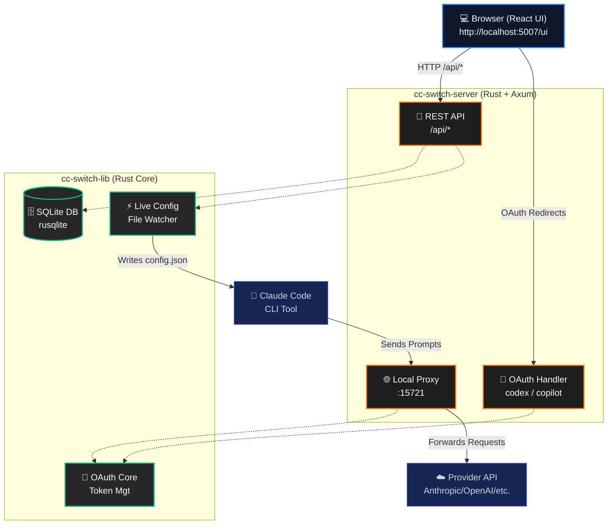

# CC Switch Web

**Managing Claude Code Provider configurations has never been easier.**

[](https://github.com/huangbogeng/cc-switch-ui)
[](https://github.com/huangbogeng/cc-switch-ui)
[](LICENSE)

[**中文文档**](README_zh.md)

---

## 🎯 What It Solves

Configuring API Providers for Claude Code traditionally requires manually editing JSON files, memorizing various API endpoints, and handling complex OAuth authorization flows. 

**CC Switch Web allows you to manage all of this effortlessly within your browser:**

- **One-click Provider Switching:** Instantly switch between different model providers without ever touching a config file.
- **Built-in Presets:** Comes with 6 pre-configured popular providers (MiniMax, SiliconFlow, DeepSeek, OpenRouter, Gemini Native, Codex).
- **Dual Authentication Support:** Supports both API Key and OAuth authentication flows.
- **Real-time Live Sync:** Changes are immediately synchronized with your local Claude Code configuration and take effect instantly.

---

## 🚀 Supported Providers

| Provider | Type | Auth Method | Description |
|----------|------|-------------|-------------|
| **MiniMax** | Official | API Key | MiniMax M2.7 Model |
| **SiliconFlow** | Aggregator | API Key | Supports various models |
| **DeepSeek** | Official | API Key | DeepSeek V4 Model |
| **OpenRouter** | Aggregator | API Key | 100+ Models available |
| **Gemini Native**| Google | API Key | Native Gemini API |
| **Codex** | OpenAI | OAuth | Proxied via local server |

---

## 🏁 Quick Start

### Easy Installation (Linux & macOS)

The easiest way to install CC Switch Web is using our installation script:

```bash
curl -fsSL https://raw.githubusercontent.com/huangbogeng/cc-switch-ui/main/install.sh | bash
```

After installation, simply run:

```bash
cc-switch-ui
```

The installer places the application under `~/.local/share/cc-switch-ui` by default. User data stays in `~/.cc-switch`, including the SQLite database.

### CLI Commands

`cc-switch-ui start` launches the backend server and serves frontend static assets (`/ui`) in one process (production mode).

```bash
# Start with defaults: 0.0.0.0:5007, proxy 15721
cc-switch-ui start

# Custom bind/proxy ports
cc-switch-ui start --host 127.0.0.1 --port 5007 --proxy-port 15721

# Health check
cc-switch-ui status

# Show version
cc-switch-ui version

# Diagnose installation/path/permission issues
cc-switch-ui doctor
```

### Build from Source

If you prefer to build from source:

```bash
# Build frontend assets first (required for /ui in production mode)
cd cc-switch-ui && npm ci && npm run build && cd ..

# Build and run CLI entrypoint
cargo build --release
cargo run -p cc-switch-cli -- start
```

### 2. Access the Web UI

Open your browser and navigate to: **http://localhost:5007/ui**

*(Note: An admin token is required for the first login, which can be found printed in your terminal startup logs.)*

### 3. Add a Provider

1. Go to the **Providers** page in the dashboard.
2. Select a preset or configure a custom endpoint.
3. Enter your API Key.
4. Click **Save** and switch to it.

Claude Code will immediately start using the new Provider you selected.

---

## ✨ Features

### 🔌 Provider Management
- 6 built-in Provider presets for quick setup.
- Support for custom Provider configurations.
- One-click switching with real-time configuration sync.

### 🔑 OAuth Authentication
- **Codex**: Forward OAuth requests securely via the local proxy.
- **GitHub Copilot**: OAuth authentication *(Currently in development)*.

### 🌐 Local Proxy Server
- Built-in local proxy service to handle Codex requests.
- Supports both HTTP and SOCKS5 proxy configurations.
- Handles streaming response format conversions seamlessly.

### ⚡ Live Config
- Automatically writes configurations directly to Claude Code when switching Providers.
- Completely eliminates the need to manually edit config files.

---

## 🏗 Architecture

CC Switch Web is a pure Web architecture variant, separating the React frontend and Rust backend:



---

## ⚙️ Configuration

| Environment Variable | Default Value | Description |
|----------------------|---------------|-------------|
| `CC_SWITCH_ADMIN_TOKEN` | *Auto-generated* | Admin password for Web UI |
| `CC_SWITCH_PROXY_PORT` | `15721` | Port for the local proxy server |
| `CC_SWITCH_TEST_HOME` | `-` | Home directory for testing purposes |

---

## 🛠 Development

### Frontend (React + TypeScript + Vite)

```bash
cd cc-switch-ui
pnpm install
pnpm dev        # Start dev server on http://localhost:5173
pnpm build      # Production build
pnpm lint       # Run ESLint checks
```

### Backend (Rust + Axum)

```bash
cargo run -p cc-switch-server     # Run backend server directly
cargo fmt && cargo clippy      # Formatting and linting
cargo test                     # Run tests
```

### Project Structure

```text
cc-switch-ui/          # React frontend workspace
cc-switch-server/         # Axum HTTP server (Rust)
cc-switch-lib/         # Shared core library (Rust)
  └── src/
      ├── database/    # SQLite persistence via rusqlite
      ├── oauth/       # OAuth handling (Codex + Copilot)
      ├── config.rs    # Configuration management
      └── live.rs      # Live Config synchronization
```

---

## 🔄 Differences from the Original cc-switch

This project is a fork of the excellent [cc-switch](https://github.com/farion1231/cc-switch). Here are the main differences:

| Feature | cc-switch (Original) | CC Switch Web (This Project) |
|---------|----------------------|------------------------------|
| **Deployment** | Tauri Desktop App | Pure Web Service |
| **System Tray** | Supported | Not Supported |
| **MCP Management**| Supported | *Planned* |
| **Cloud Sync** | Supported | Not Supported |
| **Core Focus** | Full feature set | Focused on Provider Management |

---

## 🙏 Acknowledgements

Built upon the excellent open-source project [cc-switch](https://github.com/farion1231/cc-switch).

---

## 📄 License

This project is licensed under the [MIT License](LICENSE).
