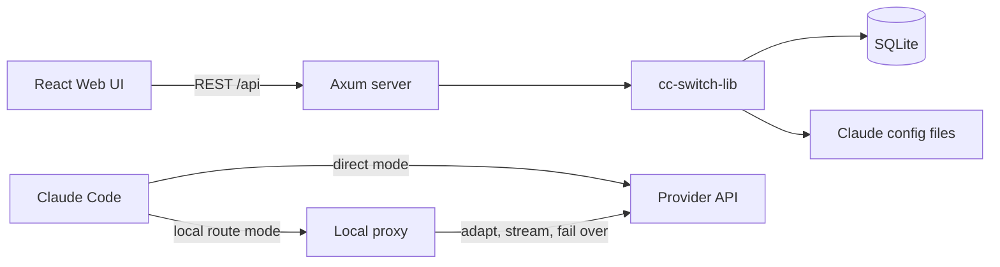

# CC Switch UI

**A browser-first provider manager and local routing service for Claude Code.**

[](https://github.com/huangbogeng/cc-switch-ui)
[](https://github.com/huangbogeng/cc-switch-ui)
[](LICENSE)

[中文文档](README_zh.md)

CC Switch UI manages Claude Code providers, OAuth accounts, MCP servers, Skills, usage data, and a local protocol-converting proxy from one web interface. It is a Web/Rust fork of [cc-switch](https://github.com/farion1231/cc-switch), designed for headless machines and browser-based administration.

> The admin API listens on `127.0.0.1` by default. Only use `--host 0.0.0.0` on a trusted network and protect the admin token.

## Contents

- [How it works](#how-it-works)
- [Features](#features)
- [Supported providers](#supported-providers)
- [Quick start](#quick-start)
- [Configuration and data](#configuration-and-data)
- [Architecture](#architecture)
- [Development](#development)
- [Project scope](#project-scope)

## How it works

CC Switch UI keeps direct provider selection and local routing as two separate controls:

| Mode | What Claude Code uses | When to use it |
|------|------------------------|----------------|
| **Direct configuration** | The selected provider's endpoint and credentials are written to `~/.claude/settings.json` | Simple provider switching without a local proxy |
| **Local route** | Claude Code connects to the local proxy, which forwards to the selected route target | Protocol conversion, request logs, circuit breaking, or failover |

Changing the route target does not overwrite the selected direct provider. Stopping the local route restores a consistent direct configuration.

## Features

- **Provider management:** maintained presets, custom compatible endpoints, endpoint detection, model discovery, and one-click switching.
- **Local routing:** Anthropic, OpenAI Chat, OpenAI Responses, and Gemini adapters; streaming conversion; circuit breaker; and failover queue.
- **OAuth accounts:** device-code flows and multi-account management for Codex and GitHub Copilot, including GHES support.
- **MCP servers:** CRUD, import, per-server enable/disable, and merge-safe synchronization to `~/.claude.json`.
- **Claude Code Skills:** CRUD, collections, import, and synchronization from `~/.cc-switch/skills/` to `~/.claude/skills/`.
- **Usage monitoring:** proxy request logs plus optional import of Claude Code session JSONL files, with source breakdown and trend charts.
- **Live configuration:** merge-only updates preserve unrelated fields in Claude Code configuration files.

## Supported providers

The UI includes seven maintained presets and also accepts custom compatible endpoints.

| Provider | Type | Authentication | Notes |
|----------|------|----------------|-------|
| DeepSeek | Official | API key | DeepSeek chat and reasoning models |
| Codex | OpenAI | OAuth | ChatGPT Plus/Pro subscription |
| MiniMax | Official | API key | MiniMax models |
| SiliconFlow | Aggregator | API key | Multi-model catalog |
| OpenRouter | Aggregator | API key | Multi-provider model catalog |
| [OrcaRouter](https://www.orcarouter.ai/ref/ref_c975e760c319b5162c21) | Aggregator | API key | Native Anthropic API and multi-provider model catalog |
| Gemini Native | Google | API key | Native Gemini API format |

To use OrcaRouter, [create an account or obtain an API key through the project link](https://www.orcarouter.ai/ref/ref_c975e760c319b5162c21), then select the built-in **OrcaRouter** preset. The preset can fetch the current model list from the service.

Custom providers can use `anthropic`, `openai_chat`, `openai_responses`, or Gemini-compatible protocols. For an unknown endpoint, use **Detect endpoint type** and **Fetch models** in the provider editor.

## Quick start

### 1. Install on Linux or macOS

```bash
curl -fsSL https://raw.githubusercontent.com/huangbogeng/cc-switch-ui/main/install.sh | bash
```

The installer places the application under `~/.local/share/cc-switch-ui` and keeps user data in `~/.cc-switch`.

For other platforms, download a build from [GitHub Releases](https://github.com/huangbogeng/cc-switch-ui/releases) or build from source.

### 2. Start the service

```bash
# Defaults: admin UI on 127.0.0.1:5007, local proxy on 15721
cc-switch-ui start
```

Open [http://localhost:5007/ui](http://localhost:5007/ui) and sign in with the admin token printed in the startup log.

Useful CLI commands:

```bash
cc-switch-ui status   # Check service health
cc-switch-ui doctor   # Diagnose installation, PATH, and permission issues
cc-switch-ui version  # Print the installed version
cc-switch-ui stop     # Stop the managed service
```

To listen beyond the local machine, opt in explicitly:

```bash
cc-switch-ui start --host 0.0.0.0 --port 5007 --proxy-port 15721
```

### 3. Add and switch a provider

1. Open **Providers**.
2. Choose a preset or create a custom provider.
3. Enter the required API key or complete OAuth authorization.
4. Save the provider and select **Switch**.

Claude Code immediately uses the selected direct provider.

### 4. Optional: enable the local route

1. In **Providers**, choose a **Route Target** in the **Local Route** panel.
2. Start the local route.

Claude Code now sends requests to the local proxy, which adapts and forwards them to the route target. Stop the route to return to direct configuration.

## Configuration and data

### Environment variables

| Variable | Default | Description |
|----------|---------|-------------|
| `CC_SWITCH_ADMIN_TOKEN` | Generated at startup | Admin token for the Web UI and API |
| `CC_SWITCH_PROXY_PORT` | `15721` | Local proxy listening port |
| `CC_SWITCH_UI_DIR` | Auto-detected | Directory containing built frontend assets |

The admin host and port can be changed with `cc-switch-ui start --host ... --port ...`. CLI settings are persisted in `~/.cc-switch/cli.json`.

### Managed paths

| Path | Purpose |
|------|---------|
| `~/.cc-switch/cc-switch.db` | Providers, accounts, routes, MCP, Skills metadata, and usage data |
| `~/.cc-switch/cli.json` | CLI host and port settings |
| `~/.cc-switch/skills/` | Skills source of truth managed by CC Switch UI |
| `~/.claude/settings.json` | Active Claude Code provider configuration |
| `~/.claude.json` | Claude Code MCP server configuration |
| `~/.claude/skills/` | Enabled Claude Code Skills |

Back up `~/.cc-switch` before migrating or removing an installation. API keys and OAuth credentials are sensitive data.

## Architecture



The Rust workspace contains three crates:

- `cc-switch-cli`: installation-facing command-line entry point and service lifecycle.
- `cc-switch-server`: REST API, OAuth callbacks, static UI hosting, and local proxy.
- `cc-switch-lib`: persistence, live configuration, MCP/Skills synchronization, and OAuth core logic.

The frontend lives in `cc-switch-ui/` and is built with React, TypeScript, and Vite.

## Development

Requirements: Node.js 24.15+, npm, and Rust 1.85+ (`rust-toolchain.toml` pins the project toolchain).

### Run from source

```bash
# Terminal 1: backend API
cargo run -p cc-switch-server

# Terminal 2: frontend development server
cd cc-switch-ui
npm ci
npm run dev
```

For a production-style build served by the CLI:

```bash
cd cc-switch-ui
npm ci
npm run build
cd ..
cargo run -p cc-switch-cli -- start
```

### Quality checks

```bash
cargo fmt --all -- --check
cargo clippy --workspace --all-targets -- -D warnings
cargo test --workspace

cd cc-switch-ui
npm test
npm run lint
npm run build
```

### Repository layout

```text
cc-switch-cli/       CLI and service lifecycle
cc-switch-lib/       Shared domain logic and SQLite persistence
cc-switch-server/    REST API, OAuth handlers, and local proxy
cc-switch-ui/        React frontend
install.sh           Linux/macOS installer
```

Provider and proxy changes should keep protocol-specific behavior inside adapter boundaries, preserve switch/start/stop live-config consistency, and include tests for request, response, streaming, usage, and failure behavior where applicable.

See [CONTRIBUTING.md](CONTRIBUTING.md) and [CODE_OF_CONDUCT.md](CODE_OF_CONDUCT.md) before submitting a change.

## Project scope

| Capability | cc-switch | CC Switch UI |
|------------|-----------|--------------|
| Deployment | Tauri desktop application | Browser UI and headless Web service |
| System tray | Yes | No |
| Tool focus | Multiple AI coding tools | Claude Code CLI |
| MCP and Skills | Yes | Yes, Claude Code focused |
| Cloud sync | Yes | No |
| OAuth accounts | Multiple providers | Codex and GitHub Copilot multi-account support |

## Acknowledgements

CC Switch UI is built from the open-source [cc-switch](https://github.com/farion1231/cc-switch) project. Thanks to its maintainers and contributors.

## License

Licensed under the [MIT License](LICENSE).
