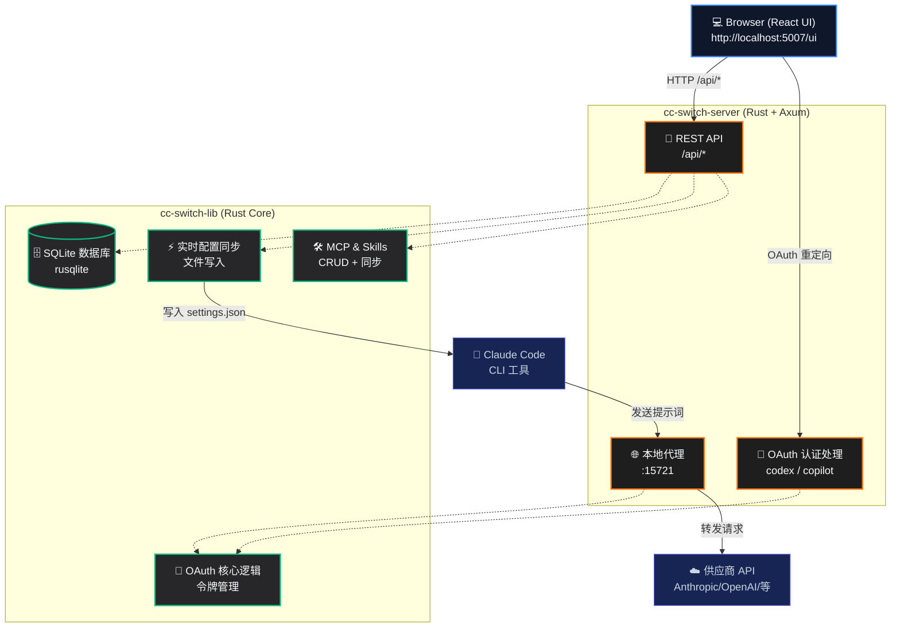

# CC Switch UI

**让 Claude Code 的 Provider 配置管理更简单。**

[](https://github.com/huangbogeng/cc-switch-ui)
[](https://github.com/huangbogeng/cc-switch-ui)
[](LICENSE)

[**English Version**](README.md)

---

## 🎯 它解决了什么问题

传统配置 Claude Code 的 API Provider 需要手动编辑 JSON 文件、记住各种 API 端点、并且还要处理复杂的 OAuth 授权。

**CC Switch UI 让这一切都能以浏览器为中心轻松完成：**

- **一键切换 Provider：** 无需手动编辑配置，一键即可在 50+ 模型供应商之间切换。
- **内置丰富预设：** 50+ 种 Provider 预设（DeepSeek、OpenAI、Anthropic、Google、Copilot、Codex、MiniMax 等）。
- **双重认证支持：** 支持 API Key 和 OAuth 两种认证方式。
- **实时配置同步：** 切换配置后自动写入 Claude Code 本地配置文件，立即生效。

---

## 📌 当前进度（2026-05-14）

- **核心功能已全部完成**：Provider（50+ 预设）、MCP 服务器、Skills、代理、OAuth、用量追踪。
- 后端数据库模块已按领域拆分（`providers`、`mcp`、`skills`、`proxy`、`usage`、`migrations`、`types`）。
- 代理流式转换链路已模块化到 `cc-switch-server/src/proxy/streaming/`。
- 用量统计已支持两条路径：代理日志 + Claude 本地会话日志同步（`~/.claude/projects/*/*.jsonl`）。
- 当前重点：推进 Phase 2（`forwarder.rs` 拆分），同时避免把文件拆得过度细碎。

---

## 🚀 支持的 Provider

50+ 个 Provider 预设，包括：

| Provider | 类型 | 认证方式 | 说明 |
|----------|------|---------|------|
| **Anthropic** | 官方 | API Key | Claude Opus, Sonnet, Haiku 系列 |
| **OpenAI** | 官方 | API Key | GPT 系列、o 系列模型 |
| **DeepSeek** | 官方 | API Key | DeepSeek V4、R1 模型 |
| **Google Gemini** | 官方 | API Key | Gemini 2.5、2.0 模型 |
| **Copilot** | GitHub | OAuth | 通过 GitHub Copilot 使用 GPT/Claude |
| **Codex** | OpenAI | OAuth | ChatGPT Plus/Pro 订阅 |
| **MiniMax** | 官方 | API Key | M2.7 及其他模型 |
| **SiliconFlow** | 聚合平台 | API Key | 支持多种模型 |
| **OpenRouter** | 聚合平台 | API Key | 200+ 模型可选 |

---

## 🏁 快速开始

### 一键安装 (Linux & macOS)

最简单的安装方式是使用我们的自动安装脚本：

```bash
curl -fsSL https://raw.githubusercontent.com/huangbogeng/cc-switch-ui/main/install.sh | bash
```

安装完成后，直接运行即可启动服务：

```bash
cc-switch-ui
```

安装脚本默认把程序放在 `~/.local/share/cc-switch-ui`。用户数据仍保留在 `~/.cc-switch`，包括 SQLite 数据库。

### CLI 命令

`cc-switch-ui start` 会在一个进程里同时启动后端服务，并托管前端静态资源（`/ui`，生产模式）。

```bash
# 默认启动：0.0.0.0:5007，代理端口 15721
cc-switch-ui start

# 自定义监听地址和代理端口
cc-switch-ui start --host 127.0.0.1 --port 5007 --proxy-port 15721

# 健康检查
cc-switch-ui status

# 查看版本
cc-switch-ui version

# 诊断安装/PATH/权限问题
cc-switch-ui doctor
```

### 源码编译

如果你更倾向于从源码编译：

```bash
# 先构建前端静态资源（生产模式 /ui 必需）
cd cc-switch-ui && npm ci && npm run build && cd ..

# 编译并启动 CLI 入口
cargo build --release
cargo run -p cc-switch-cli -- start
```

### 访问 Web UI

打开浏览器并访问：**http://localhost:5007/ui**

*（注：首次登录需要使用 admin token，可以在控制台的启动日志中找到。）*

### 3. 添加 Provider

1. 进入仪表盘的 **Providers** 页面。
2. 选择一个内置预设，或者配置自定义的 API 端点。
3. 填入你的 API Key。
4. 点击保存并一键切换。

Claude Code 将会立即开始使用你新选中的 Provider。

---

## ✨ 功能特性

### 🔌 Provider 管理
- 50+ 内置 Provider 预设，快速上手。
- 支持自定义 Provider 配置。
- 一键无缝切换，配置实时生效。
- 故障转移队列和熔断器。

### 🔑 OAuth 认证
- **Codex**：设备码 OAuth 流程，支持 ChatGPT Plus/Pro 订阅。
- **GitHub Copilot**：设备码 OAuth 流程，支持多账号和 GHES。
- Codex 和 Copilot 均支持多账号管理。

### 🛠 MCP 服务器
- 完整 CRUD 管理，支持 JSON 编辑器。
- 同步到 `~/.claude.json`，保留其他根字段。
- 从现有 Claude Code 配置导入。
- 每个服务器独立启用/禁用。

### 📦 Skills
- Claude Code Skills 的完整 CRUD 管理。
- 从 SSOT（`~/.cc-switch/skills/`）同步到 `~/.claude/skills/`。
- 从 `~/.claude/skills/` 和 `~/.claude/plugins/` 导入。
- 按集合（collection）分组，支持启用/禁用。

### 🌐 本地代理服务器
- HTTP 代理，监听端口 15721（可配置）。
- Provider 适配器链，请求/响应格式转换。
- 每个 Provider 独立熔断器，故障转移队列。
- 流式响应转换（Anthropic ↔ OpenAI 格式互转）。

### ⚡ Live Config (实时配置)
- 切换 Provider 时自动将配置写入 Claude Code。
- 仅合并 env 字段，保留 `settings.json` 中的其他配置。
- 彻底告别手动编辑配置文件的烦恼。

### 📊 用量监控（当前实现口径）
- 请求日志与趋势图主要来自 `proxy_request_logs`。
- 支持通过 `POST /api/usage/sync-session` 手动同步 Claude 本地 JSONL 会话日志。
- 支持通过 `GET /api/usage/sources` 查看数据来源占比（`proxy` / `session_log`）。
- `model_pricing` 当前用于 session 同步数据的成本计算；proxy 侧写入记录目前 `total_cost_usd` 仍可能为空/0（后续链路可继续补齐）。

---

## 🏗 技术架构

CC Switch UI 采用浏览器优先的 Web 架构，后端为 Rust workspace：



---

## ⚙️ 配置说明

| 环境变量 | 默认值 | 说明 |
|---------|--------|------|
| `CC_SWITCH_ADMIN_TOKEN` | *自动生成* | Web UI 管理员密码 |
| `CC_SWITCH_PROXY_PORT` | `15721` | 本地代理服务器监听端口 |
| `CC_SWITCH_TEST_HOME` | `-` | 用于测试的系统 home 目录 |

---

## 🛠 开发指南

### 前端 (React + TypeScript + Vite)

```bash
cd cc-switch-ui
pnpm install
pnpm dev        # 启动开发服务器 (http://localhost:5173)
pnpm build      # 生产环境构建
pnpm lint       # 运行 ESLint 检查
```

### 后端 (Rust + Axum)

```bash
cargo run -p cc-switch-server     # 直接运行后端服务器
cargo fmt && cargo clippy      # 代码格式化和 Lint 检查
cargo test                     # 运行测试
```

### 项目目录结构

```text
cc-switch-ui/          # React 前端工作区
  └── src/
      ├── api/         # API 客户端层
      ├── components/  # 可复用 UI 组件
      └── pages/       # Dashboard, Providers, MCP, Skills 等
cc-switch-server/      # Axum HTTP 服务器 (Rust)
  └── src/
      ├── handlers/    # REST API 处理函数 (providers, mcp, skills 等)
      └── proxy/       # HTTP 代理服务器及流式转换
cc-switch-lib/         # 共享核心库 (Rust)
  └── src/
      ├── database/    # SQLite 持久化（已模块化）
      │   ├── types.rs
      │   ├── providers.rs
      │   ├── mcp.rs
      │   ├── skills.rs
      │   ├── proxy.rs
      │   ├── usage.rs
      │   └── migrations.rs
      ├── oauth/       # OAuth 认证逻辑 (Codex + Copilot)
      ├── mcp.rs       # MCP 同步逻辑
      ├── skills.rs    # Skills 同步 + 导入逻辑
      ├── config.rs    # 配置管理模块
      └── live.rs      # Live Config 同步到 settings.json
```

---

## 🔄 与原版 cc-switch 的区别

本项目是优秀开源项目 [cc-switch](https://github.com/farion1231/cc-switch) 的分支。主要区别如下：

| 特性 | cc-switch (原版) | CC Switch UI (本项目) |
|------|-----------------|----------------------|
| **部署方式** | Tauri 桌面应用 | 纯 Web 服务 |
| **系统托盘** | 支持 | 不支持 |
| **MCP 管理** | 支持 | 支持 |
| **Skills 管理** | 不支持 | 支持 |
| **云同步**   | 支持 | 不支持 |
| **多账号 OAuth** | 不支持 | 支持 |
| **核心定位** | 全功能集合 | 无头服务器，专为 Claude Code CLI 设计 |

---

## 🙏 致谢

本项目基于优秀的开源项目 [cc-switch](https://github.com/farion1231/cc-switch) 进行开发。

---

## 📄 License

本项目基于 [MIT License](LICENSE) 开源。
