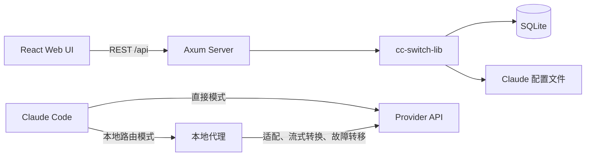

# CC Switch UI

**面向 Claude Code 的浏览器 Provider 管理器与本地路由服务。**

[](https://github.com/huangbogeng/cc-switch-ui)
[](https://github.com/huangbogeng/cc-switch-ui)
[](LICENSE)

[English](README.md)

CC Switch UI 在一个 Web 界面中管理 Claude Code 的 Provider、OAuth 账号、MCP Server、Skills、用量数据与本地协议转换代理。项目基于 [cc-switch](https://github.com/farion1231/cc-switch) 演进，采用 Web + Rust 架构，适合无头服务器和浏览器管理场景。

> 管理接口默认只监听 `127.0.0.1`。仅应在可信网络中使用 `--host 0.0.0.0`，并妥善保管 admin token。

## 目录

- [工作方式](#工作方式)
- [功能](#功能)
- [支持的 Provider](#支持的-provider)
- [快速开始](#快速开始)
- [配置与数据](#配置与数据)
- [架构](#架构)
- [开发](#开发)
- [项目定位](#项目定位)

## 工作方式

CC Switch UI 将“直接 Provider”和“本地路由”作为两个彼此独立的控制项：

| 模式 | Claude Code 实际使用的配置 | 适用场景 |
|------|----------------------------|----------|
| **直接配置** | 将所选 Provider 的端点与凭证写入 `~/.claude/settings.json` | 不经过本地代理，快速切换 Provider |
| **本地路由** | Claude Code 连接本地代理，再由代理转发到路由目标 | 协议转换、请求日志、熔断或故障转移 |

修改路由目标不会覆盖当前选择的直接 Provider；停止本地路由后，系统会恢复一致的直接配置。

## 功能

- **Provider 管理：** 内置预设、自定义兼容端点、端点检测、模型发现和一键切换。
- **本地路由：** Anthropic、OpenAI Chat、OpenAI Responses 与 Gemini 适配器，支持流式转换、熔断器和故障转移队列。
- **OAuth 账号：** Codex 与 GitHub Copilot 设备码授权及多账号管理，并支持 GHES。
- **MCP Server：** CRUD、导入、独立启停，以及合并式同步到 `~/.claude.json`。
- **Claude Code Skills：** CRUD、集合管理、导入，并从 `~/.cc-switch/skills/` 同步到 `~/.claude/skills/`。
- **用量监控：** 代理请求日志及可选的 Claude Code 本地会话 JSONL 导入，提供来源拆分和趋势图。
- **实时配置：** 采用合并式写入，保留 Claude Code 配置文件中的无关字段。

## 支持的 Provider

UI 内置 7 个持续维护的预设，同时支持自定义兼容端点。

| Provider | 类型 | 认证方式 | 说明 |
|----------|------|----------|------|
| DeepSeek | 官方 | API Key | DeepSeek 对话与推理模型 |
| Codex | OpenAI | OAuth | ChatGPT Plus/Pro 订阅 |
| MiniMax | 官方 | API Key | MiniMax 模型 |
| SiliconFlow | 聚合平台 | API Key | 多模型目录 |
| OpenRouter | 聚合平台 | API Key | 多供应商模型目录 |
| [OrcaRouter](https://www.orcarouter.ai/ref/ref_c975e760c319b5162c21) | 聚合平台 | API Key | Anthropic 原生接口与多供应商模型目录 |
| Gemini Native | Google | API Key | Gemini 原生 API 格式 |

使用 OrcaRouter 时，可通过[项目专属链接注册或获取 API Key](https://www.orcarouter.ai/ref/ref_c975e760c319b5162c21)，然后选择内置的 **OrcaRouter** 预设。该预设可以从服务端获取当前模型列表。

自定义 Provider 可选择 `anthropic`、`openai_chat`、`openai_responses` 或 Gemini 兼容协议。面对未知端点时，可在 Provider 编辑器中使用**检测端点类型**与**获取模型**。

## 快速开始

### 1. 在 Linux 或 macOS 上安装

```bash
curl -fsSL https://raw.githubusercontent.com/huangbogeng/cc-switch-ui/main/install.sh | bash
```

安装脚本默认将程序放在 `~/.local/share/cc-switch-ui`，用户数据保存在 `~/.cc-switch`。

其他平台可从 [GitHub Releases](https://github.com/huangbogeng/cc-switch-ui/releases) 下载构建产物，或按照后文从源码构建。

### 2. 启动服务

```bash
# 默认：管理界面监听 127.0.0.1:5007，本地代理监听 15721
cc-switch-ui start
```

打开 [http://localhost:5007/ui](http://localhost:5007/ui)，使用启动日志中打印的 admin token 登录。

常用 CLI 命令：

```bash
cc-switch-ui status   # 检查服务状态
cc-switch-ui doctor   # 诊断安装、PATH 与权限问题
cc-switch-ui version  # 查看安装版本
cc-switch-ui stop     # 停止托管服务
```

如果确实需要从其他设备访问，请显式开放监听：

```bash
cc-switch-ui start --host 0.0.0.0 --port 5007 --proxy-port 15721
```

### 3. 添加并切换 Provider

1. 打开 **Providers** 页面。
2. 选择预设，或新建自定义 Provider。
3. 填写 API Key，或完成 OAuth 授权。
4. 保存后点击**切换**。

Claude Code 会立即使用所选的直接 Provider。

### 4. 可选：启用本地路由

1. 在 **Providers** 页面的**本地路由**区域选择**路由目标**。
2. 启动本地路由。

此后 Claude Code 的请求会先进入本地代理，再经过适配后转发到路由目标。停止路由即可回到直接配置。

## 配置与数据

### 环境变量

| 变量 | 默认值 | 说明 |
|------|--------|------|
| `CC_SWITCH_ADMIN_TOKEN` | 启动时生成 | Web UI 与 API 的管理 token |
| `CC_SWITCH_PROXY_PORT` | `15721` | 本地代理监听端口 |
| `CC_SWITCH_UI_DIR` | 自动检测 | 前端构建产物所在目录 |

管理接口的 host 与 port 可通过 `cc-switch-ui start --host ... --port ...` 修改。CLI 配置会持久化到 `~/.cc-switch/cli.json`。

### 管理的路径

| 路径 | 用途 |
|------|------|
| `~/.cc-switch/cc-switch.db` | Provider、账号、路由、MCP、Skills 元数据与用量数据 |
| `~/.cc-switch/cli.json` | CLI host 与 port 配置 |
| `~/.cc-switch/skills/` | CC Switch UI 管理的 Skills 单一事实源 |
| `~/.claude/settings.json` | Claude Code 当前 Provider 配置 |
| `~/.claude.json` | Claude Code MCP Server 配置 |
| `~/.claude/skills/` | 已启用的 Claude Code Skills |

迁移或移除安装前，请备份 `~/.cc-switch`。API Key 与 OAuth 凭证属于敏感数据。

## 架构



Rust workspace 包含三个 crate：

- `cc-switch-cli`：面向安装用户的命令行入口与服务生命周期管理。
- `cc-switch-server`：REST API、OAuth 回调、前端静态资源托管和本地代理。
- `cc-switch-lib`：持久化、实时配置、MCP/Skills 同步与 OAuth 核心逻辑。

前端位于 `cc-switch-ui/`，使用 React、TypeScript 与 Vite。

## 开发

环境要求：Node.js 20.19+（或 22.12+）、npm 与 Rust 1.85+（项目工具链由 `rust-toolchain.toml` 固定）。

### 从源码运行

```bash
# 终端 1：后端 API
cargo run -p cc-switch-server

# 终端 2：前端开发服务器
cd cc-switch-ui
npm ci
npm run dev
```

如需由 CLI 托管前端构建产物：

```bash
cd cc-switch-ui
npm ci
npm run build
cd ..
cargo run -p cc-switch-cli -- start
```

### 质量检查

```bash
cargo fmt --all -- --check
cargo clippy --workspace --all-targets -- -D warnings
cargo test --workspace

cd cc-switch-ui
npm test
npm run lint
npm run build
```

### 仓库结构

```text
cc-switch-cli/       CLI 与服务生命周期
cc-switch-lib/       共享领域逻辑与 SQLite 持久化
cc-switch-server/    REST API、OAuth 处理与本地代理
cc-switch-ui/        React 前端
install.sh           Linux/macOS 安装脚本
```

修改 Provider 或代理行为时，应将协议特定逻辑限制在适配器边界内，保证切换/启动/停止过程中的实时配置一致性，并根据影响范围覆盖请求、响应、流式传输、用量与失败行为测试。

提交修改前请阅读 [CONTRIBUTING.md](CONTRIBUTING.md) 与 [CODE_OF_CONDUCT.md](CODE_OF_CONDUCT.md)。

## 项目定位

| 能力 | cc-switch | CC Switch UI |
|------|-----------|--------------|
| 部署方式 | Tauri 桌面应用 | 浏览器 UI 与无头 Web 服务 |
| 系统托盘 | 支持 | 不支持 |
| 工具定位 | 多种 AI 编程工具 | Claude Code CLI |
| MCP 与 Skills | 支持 | 支持，聚焦 Claude Code |
| 云同步 | 支持 | 不支持 |
| OAuth 账号 | 多 Provider | Codex 与 GitHub Copilot 多账号 |

## 致谢

CC Switch UI 基于开源项目 [cc-switch](https://github.com/farion1231/cc-switch) 开发，感谢原项目维护者与贡献者。

## License

本项目基于 [MIT License](LICENSE) 开源。
