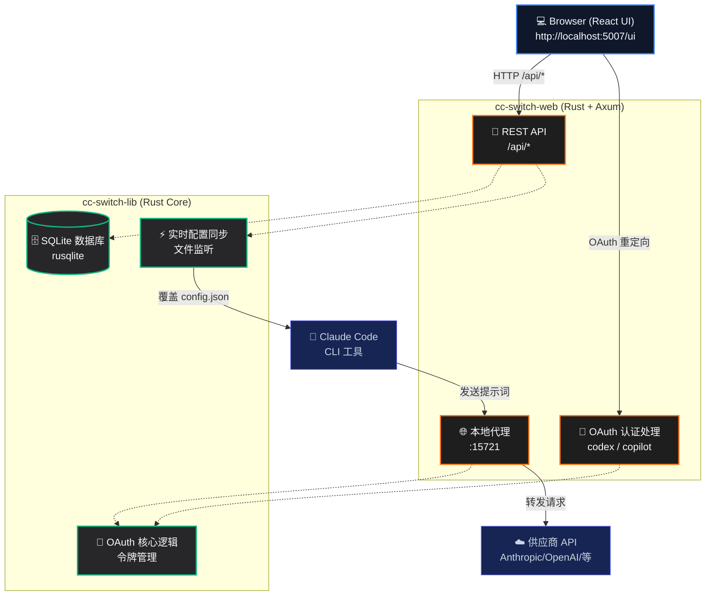

# CC Switch Web

**管理 Claude Code 的 Provider 配置从未如此简单。**

[](https://github.com/huangbogeng/cc-switch-ui)
[](https://github.com/huangbogeng/cc-switch-ui)
[](LICENSE)

[**English Version**](README.md)

---

## 🎯 它解决了什么问题

传统配置 Claude Code 的 API Provider 需要手动编辑 JSON 文件、记住各种 API 端点、并且还要处理复杂的 OAuth 授权。

**CC Switch Web 让这一切都在浏览器中轻松完成：**

- **一键切换 Provider：** 无需手动编辑配置，一键即可切换不同的模型供应商。
- **内置丰富预设：** 内置 6 种常用 Provider 预设（MiniMax、SiliconFlow、DeepSeek、OpenRouter、Gemini Native、Codex）。
- **双重认证支持：** 支持 API Key 和 OAuth 两种认证方式。
- **实时配置同步：** 切换配置后自动写入 Claude Code 本地配置文件，立即生效。

---

## 🚀 支持的 Provider

| Provider | 类型 | 认证方式 | 说明 |
|----------|------|---------|------|
| **MiniMax** | 国内官方 | API Key | MiniMax M2.7 模型 |
| **SiliconFlow** | 聚合平台 | API Key | 支持多种模型 |
| **DeepSeek** | 国内官方 | API Key | DeepSeek V4 模型 |
| **OpenRouter** | 聚合平台 | API Key | 100+ 模型可选 |
| **Gemini Native**| Google | API Key | Gemini 原生 API |
| **Codex** | OpenAI | OAuth | 通过本地代理转发 |

---

## 🏁 快速开始

### 一键安装 (Linux & macOS)

最简单的安装方式是使用我们的自动安装脚本：

```bash
curl -fsSL https://raw.githubusercontent.com/huangbogeng/cc-switch-ui/main/install.sh | bash
```

安装完成后，直接运行即可启动服务：

```bash
cc-switch-web
```

安装脚本默认把程序放在 `~/.local/share/cc-switch-web`。用户数据仍保留在 `~/.cc-switch`，包括 SQLite 数据库。

### 源码编译

如果你更倾向于从源码编译：

```bash
# 编译
cargo build --release

# 运行服务
cargo run --bin cc-switch-web
```

### 访问 Web UI

打开浏览器并访问：**http://localhost:5007/ui**

*（注：首次登录需要使用 admin token，可以在控制台的启动日志中找到。）*

### 3. 添加 Provider

1. 进入仪表盘的 **Providers** 页面。
2. 选择一个内置预设，或者配置自定义的 API 端点。
3. 填入你的 API Key。
4. 点击保存并一键切换。

Claude Code 将会立即开始使用你新选中的 Provider。

---

## ✨ 功能特性

### 🔌 Provider 管理
- 内置 6 种 Provider 预设，快速上手。
- 支持自定义 Provider 配置。
- 一键无缝切换，配置实时生效。

### 🔑 OAuth 认证
- **Codex**：通过本地代理服务器安全转发 OAuth 请求。
- **GitHub Copilot**：OAuth 认证（*开发中*）。

### 🌐 本地代理服务器
- 内置本地代理服务，专门处理 Codex 请求转发。
- 支持 HTTP 和 SOCKS5 代理配置。
- 自动处理流式响应格式转换。

### ⚡ Live Config (实时配置)
- 在你切换 Provider 时，自动将配置写入 Claude Code。
- 彻底告别手动编辑配置文件的烦恼。

---

## 🏗 技术架构

CC Switch Web 采用纯 Web 架构，前后端分离设计：



---

## ⚙️ 配置说明

| 环境变量 | 默认值 | 说明 |
|---------|--------|------|
| `CC_SWITCH_ADMIN_TOKEN` | *自动生成* | Web UI 管理员密码 |
| `CC_SWITCH_PROXY_PORT` | `15721` | 本地代理服务器监听端口 |
| `CC_SWITCH_TEST_HOME` | `-` | 用于测试的系统 home 目录 |

---

## 🛠 开发指南

### 前端 (React + TypeScript + Vite)

```bash
cd cc-switch-ui
pnpm install
pnpm dev        # 启动开发服务器 (http://localhost:5173)
pnpm build      # 生产环境构建
pnpm lint       # 运行 ESLint 检查
```

### 后端 (Rust + Axum)

```bash
cargo run --bin cc-switch-web  # 运行 API 服务器
cargo fmt && cargo clippy      # 代码格式化和 Lint 检查
cargo test                     # 运行测试
```

### 项目目录结构

```text
cc-switch-ui/          # React 前端工作区
cc-switch-web/         # Axum HTTP 服务器 (Rust)
cc-switch-lib/         # 共享核心库 (Rust)
  └── src/
      ├── database/    # 基于 rusqlite 的 SQLite 持久化
      ├── oauth/       # OAuth 认证逻辑 (Codex + Copilot)
      ├── config.rs    # 配置管理模块
      └── live.rs      # 实时配置同步逻辑
```

---

## 🔄 与原版 cc-switch 的区别

本项目是优秀开源项目 [cc-switch](https://github.com/farion1231/cc-switch) 的分支。主要区别如下：

| 特性 | cc-switch (原版) | CC Switch Web (本项目) |
|------|-----------------|----------------------|
| **部署方式** | Tauri 桌面应用 | 纯 Web 服务 |
| **系统托盘** | 支持 | 不支持 |
| **MCP 管理** | 支持 | *规划中* |
| **云同步**   | 支持 | 不支持 |
| **核心定位** | 全功能集合 | 聚焦于轻量级 Provider 管理 |

---

## 🙏 致谢

本项目基于优秀的开源项目 [cc-switch](https://github.com/farion1231/cc-switch) 进行开发。

---

## 📄 License

本项目基于 [MIT License](LICENSE) 开源。
